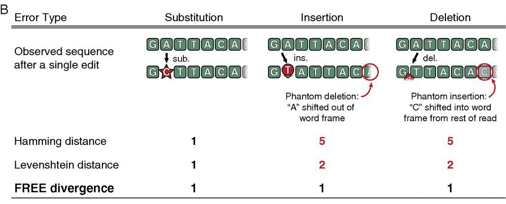

# dna-comparisons
Welcome to the DNA Comparisons repository! This repository provides a powerful tool for calculating similarity scores between DNA barcodes. Whether you're a biologist, geneticist, or researcher working with DNA sequences, this tool will assist you in analyzing and comparing DNA barcodes to uncover valuable insights.

## What are DNA Barcodes?
In the context of high throughput screening (HTS) platforms, DNA barcodes refer to short DNA sequences that are attached or associated with samples, compounds, or targets. These barcodes act as unique identifiers, allowing for efficient and accurate tracking of samples throughout the HTS process.

The DNA barcodes used in HTS platforms are typically short oligonucleotides, often around 20 to 30 base pairs in length. These sequences are designed to be unique, meaning that each barcode sequence is different from all others used in the same HTS experiment. By assigning a specific DNA barcode to each sample or compound, researchers can easily distinguish and trace individual entities within a large pool of samples.

DNA barcodes play a crucial role in various aspects of HTS platforms, including sample management, assay development, and data analysis.

## Importance of Barcode Design
DNA barcodes are designed to have significant differences from each other to ensure their uniqueness and minimize the chances of misidentification or confusion during DNA barcoding experiments. This can be caused by PCR or next generation sequencing (NGS) errors. One common way to ensure the separation of barcodes is to use a Hamming distance constraint when designing the barcode library.

The Hamming distance measures the number of positions at which two sequences differ, indicating the minimum number of substitutions required to transform one barcode into another. By maximizing the Hamming distance between barcodes, the probability of accidental similarity or overlap between different barcodes is significantly reduced.

## Comparison Approaches
Here we briefly describe the comparison approaches implemented in this package.

### Hamming Distance
The Hamming distance is a simple and widely used measure to quantify the dissimilarity between two DNA barcodes of equal length. It calculates the number of positions at which the two sequences differ, indicating the number of substitutions required to convert one barcode into another.

### Free Divergence

From Hawkins et al. [[1]](#1):


> After DNA synthesis and sequencing, a barcode of length n can be altered, and is not guaranteed to end after exactly n bases. To begin, we define a filled/truncated right-end m-edit, hereafter written “FRE m-edit,” of a DNA sequence of length n to be the result of any m-edits [substitutions (sub), insertions (ins), or deletions (del)], followed by truncating or filling with any random bases on the right (as from the unknown downstream read) as necessary to return to original length n (Fig. 1B). For any two DNA sequences X and Y of the same length, we define the FREE divergence between X and Y, written FreeDiv(X, Y), to be the minimum m such that Y is a FRE m-edit of X.

<p align="center">

</p>
<p align="center">
Figure 1B from Hawkins et al. illustrating the difference between various comparisons.
</p>

It is important to note that the major difference between the Hamming distance and Free Divergence is that the latter accounts for insertions and deletions.

## Getting Started


## Examples

```python
import itertools

# Set the barcode length
BARCODE_LENGTH = 5

# Create all possible barcode of given length
all_barcodes = ["".join(x) for x in itertools.product("ATCG", repeat=BARCODE_LENGTH)]
```

## References
<a id="1">[1]</a> 
Hawkins, John A., et al. "Indel-correcting DNA barcodes for high-throughput sequencing." Proceedings of the National Academy of Sciences 115.27 (2018): E6217-E6226.
